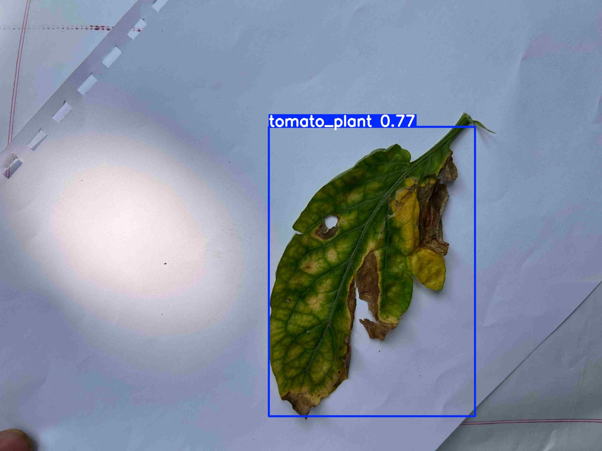

# 🍅 Tomato Leaf Disease Detection Platform


---

## 🚀 Overview

A production-oriented Computer Vision platform for detecting tomato leaf diseases using YOLOv8 and FastAPI.

This project demonstrates real-world AI deployment principles including:

- Deep Learning model integration
- REST API development
- Clean project architecture
- Scalable backend structure
- Deployment-ready configuration

The system allows users to upload a tomato leaf image and receive:

- 🍅 Disease label
- 📊 Confidence score
- 📦 Bounding box visualization

---

## 🧠 AI Model Details

- Model Type: YOLOv8 Object Detection
- Framework: PyTorch (Ultralytics)
- Task: Tomato Leaf Disease Detection
- Inference: CPU / GPU compatible
- Output:
  - Detected disease class
  - Confidence percentage
  - Bounding box overlay

> Model weights are excluded due to size limitations.

To run locally, place your trained model inside:

```
models/best.pt
```

---

## 📸 Demo

### 🖼 Original Image


### 🔍 Detection Result


---

## 🏗 System Architecture

```
User Upload
    ↓
FastAPI Backend
    ↓
YOLOv8 Detection Model
    ↓
Bounding Box + Confidence
    ↓
Frontend Display
```

This modular design ensures scalability and maintainability.

---

## 📂 Project Structure

```
tomato_disease_ai/
│
├── app/
│   ├── main.py          # FastAPI backend logic
│   └── __init__.py
│
├── ui/
│   └── index.html       # Frontend interface
│
├── assets/              # README demo images
│
├── models/              # Place best.pt here (excluded)
│
├── outputs/             # Runtime inference outputs (ignored)
│
├── requirements.txt
├── .gitignore
├── Dockerfile
├── LICENSE
└── README.md
```

---

## ⚙️ Installation

### 1️⃣ Clone Repository

```bash
git clone https://github.com/Naderalshawki/tomato_disease_ai.git
cd tomato_disease_ai
```

### 2️⃣ Install Dependencies

```bash
pip install -r requirements.txt
```

---

## ▶️ Run Locally

```bash
uvicorn app.main:app --reload
```

Open in browser:

```
http://127.0.0.1:8000
```

---

## 🐳 Docker Deployment

Build image:

```bash
docker build -t tomato-ai .
```

Run container:

```bash
docker run -p 8000:8000 tomato-ai
```

---

## 🔮 Future Enhancements

- 📱 Mobile integration
- 🚁 Drone-based crop monitoring
- 🌾 Smart agriculture dashboard
- 📊 Disease severity estimation
- 🧠 Edge AI deployment

---

## 👨‍💻 Author

**Nader Al Shawki**  
AI & Computer Vision Engineer  

Specialized in:
- Deep Learning
- Computer Vision
- AI Deployment
- Medical & Agricultural AI Systems

GitHub:
https://github.com/Naderalshawki

---

## 📜 License

This project is licensed under the MIT License.
